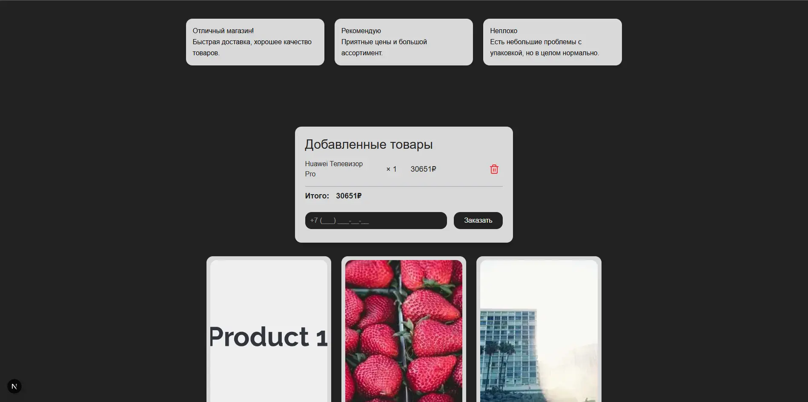
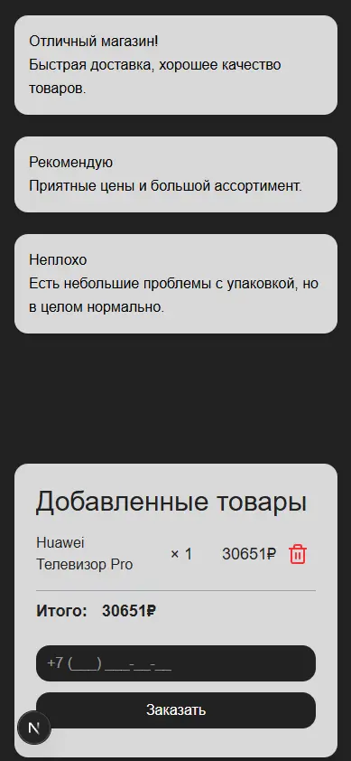

# O‑Complex Test Assignment

A fully‑featured **Next.js 15 / React 18** shop that matches the given Figma design, works on mobile, and talks to the provided REST API.

<p align="center">
  
  
</p>

---

## Implemented checklist

|    | Requirement                       | Implementation                                                        |
| -- | --------------------------------- | --------------------------------------------------------------------- |
| 1  | Responsive UI exactly as in Figma | Tailwind 4 with `rounded-[15px]`, fluid grids & breakpoints           |
| 2  | Mobile & tablet adaptation        | `grid-cols` switches + typography scale                               |
| 3  | Reviews filled from JSON HTML     | `/api/reviews` -> `ReviewList`, sanitized via **isomorphic‑dompurify** |
| 4  | Products loaded from API          | SSR first page (`fetchProductsFromLive`) + infinite scroll hook       |
| 5  | Lazy pages via AJAX on scroll     | `useInfiniteScroll` with 200 px threshold                             |
| 6  | “Купить” -> `+ / – / qty` field    | Managed in **ProductCard** state                                      |
| 7  | Cart summary autoupdates          | Derived from global cart context (`useCart`)                          |
| 8  | Cart & phone persist after reload | Stored in `localStorage` (hook)                                       |
| 9  | Phone input mask                  | In‑house formatter `+7 (999) 999‑99‑99`                               |
| 10 | Validation & red highlight        | Error message + red border if invalid                                 |
| 11 | Order request on success          | `/api/order` proxy with JSON headers                                  |
| 12 | Popup after order                 | **OrderModal**; auto‑closes after 4 s                                 |
| 13 | Improved UX preloaders            | Global **Spinner** shown while products fetch                         |
| 14 | XSS hardened                      | DOMPurify sanitisation of review HTML                                 |
| 15 | Preloader                      |  For UI satistifications                                 |
| 16 | Spinner                     | For product fetching UI                                 |

> **Bonus**: Toast notifications, graceful product‑name truncation, skeleton placeholders, strict TypeScript, ESLint + Tailwind plugin.

---

## Tech stack

* **Next.js 15 App Router** (React 18 strict‑mode)
* **TypeScript 5**
* **Tailwind CSS 4** (no extra CSS files)
* **react‑toastify** for toasts
* **react‑icons** for SVG icons
* **isomorphic‑dompurify** for SSR‑safe sanitising

---

## Quick start

```bash
pnpm i           # or npm install\pnpm dev         # http://localhost:3000
```

### Production build

```bash
pnpm build && pnpm start
```

---

## Key folders

```
src/
 ├─ app/              # App‑router pages
 ├─ components/       # UI building blocks
 |------------/Cart
 |------------/Client
 |------------/Order
 |------------/Preloader
 |------------/Product
 |------------/Review
 |------------/Spinner
 |------------/Toast
 ├─ hooks/            # useCart, useInfiniteScroll
 ├─ lib/              # API helpers, sanitize util
 └─ pages/api/        # Next.js proxy routes -> Strapi
```

---

## How to test

1. Run local dev server.
2. Scroll down – new pages load, spinner load.
3. Add / remove items, refresh page – state persists.
4. Submit order with wrong / correct phone to see validation.
5. XSS check: add `<script>alert(1)</script>` to Strapi review – it is stripped.

---

Made by GulaliG (2025)
